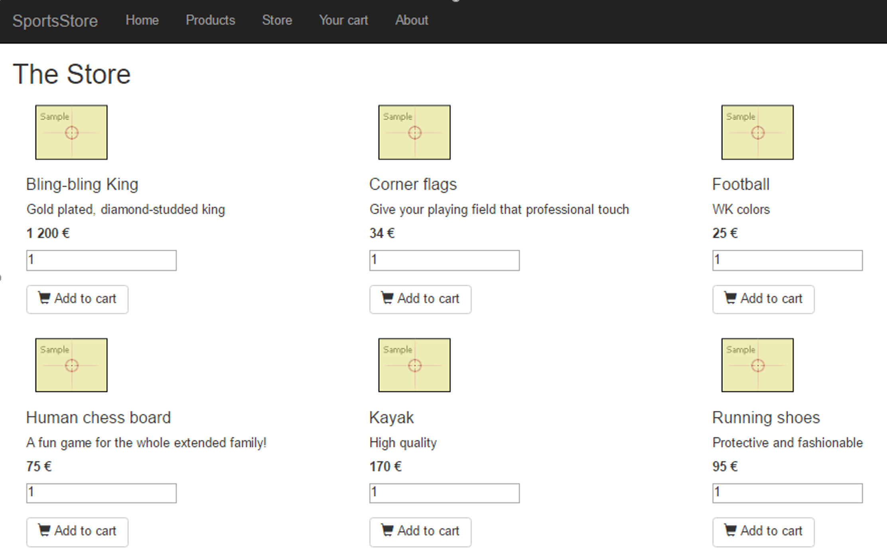
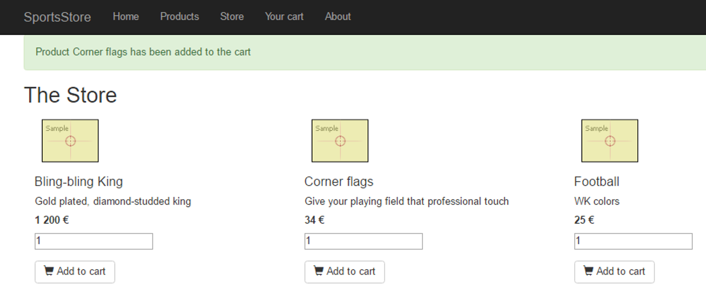
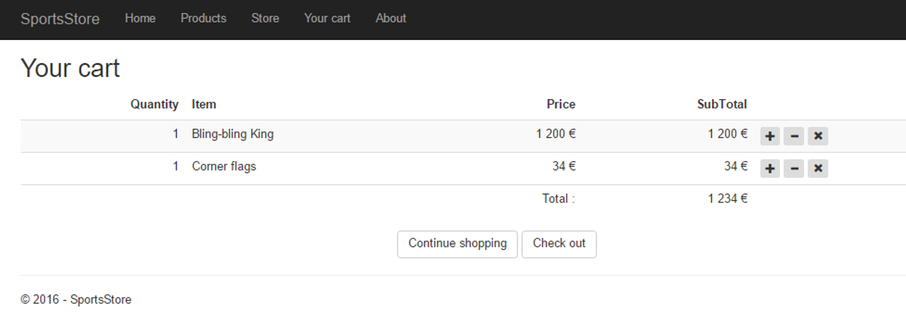
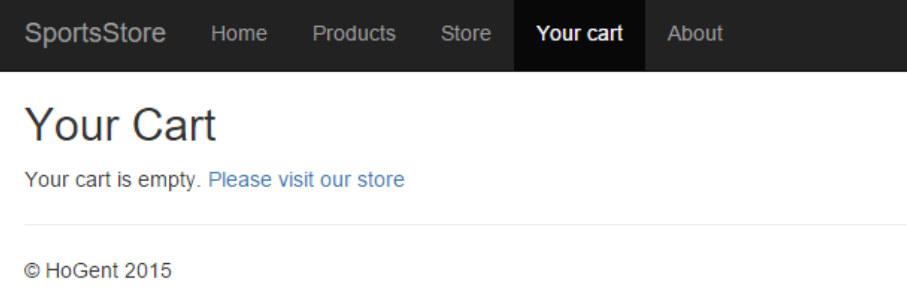

# Quickstart
1. Clone [deze repository]( https://github.com/WebIII/08exSportsStore_Part2.git)

## Achtergrond Informatie
In deze starter werd in `SportsStore.Tests` een `DummyApplicationContext` toegevoegd. Er is eveneens een klasse `ProductControllerTest` (bij aanvang kleuren nog drie testen geel en twee testen rood). Het `Moq` framework is reeds toegevoegd.

## Exception Handling - ProductController

Maak de `HttpPost` methods voor `Edit`, `Create` en `Delete` robuuster door gebruik te maken van exception handling.
- Gebruik `try...catch` blokken in de `HttpPost` `Edit` methode.
- Voeg in `_Layout.cshtml` code toe om `TempData[“message”]` en `TempData[“Error”]` te tonen net boven de `@RenderBody()`.
- Twee test methodes voor `Edit-HttpPost` kleuren momenteel nog rood:
    - Vang exceptions uit domein en data laag op via `try..catch`
    > Tip: selecteer een blok code en maak gebruik van VS refactorings om het blok code te wrappen in een try.. catch
    - Zorg voor een gepaste `TempData[“message”]` melding wanneer alles succesvol verloopt en voor een gepaste `TempData[“error”]` melding wanneer exceptions geworpen worden
    - De twee testen moeten nu slagen
    > Tip: tijdens het runnen kan je bij een edit een overtreding maken tegen de domeinregels om het effect te zien:
    -	Name is verplicht, minstens 5 karakters lang en maximum 100
    -	Price is gelegen tussen 1 en 3000.
- Pas de `HttPost` `Create` en `Delete` op analoge manier aan.
- Drie unit testen kleuren nog geel. Haal in het `Fact-attribuut` boven deze methodes de parameter `Skip = ...` weg. Werk de test methodes uit en zorg dat de testen groen kleuren.

---

## The Store
We beginnen een nieuw deel en bouwen de winkel. 

### Store - Index
Surfen naar `/Store` geeft een overzicht van alle producten die online beschikbaar zijn in alfabetische volgorde. (`product` "LifeJacket" wordt niet getoond want het is niet online beschikbaar, de afbeelding is `placeholder.gif` die in de `wwwroot/images` map werd geplaatst).



#### StoreController
- Maak in de Controllers folder een lege controller genaamd `StoreController` aan. 
- Pas de routing aan zodat de startpagina van de site `/Store/Index` wordt.
- Voeg in `_Layout` een link naar `/Store/Index` toe in de `navbar`.
- Zorg voor constructor injectie van `IProductRepository` in `StoreController`.
- Ontwikkel een unit test voor de `Index` action method, 
    - Maak een unit test klasse `StoreControllerTest` aan in de folder `Controllers`
    - Implementeer volgende test:  `Index` moet een lijst van Producten die online kunnen aangekocht worden (gebaseerd op de Products die in de `repository` zitten) doorgeven aan de view via het model.
    - Maak in de constructor een `mockProductRepository` aan en instantieer de `StoreController`
    - Train de mock voor de `repository` methode `GetByAvailability`. Maak hiervoor gebruik van de property `ProductsOnline` in de `DummyApplicationDbContext`. Merk op: het product Kayak is enkel in de shop beschikbaar en niet online, het aantal online available producten is dus 10. 
    - Schrijf de gepaste unit test voor de `Index` methode.
    - Run de test. Deze moet falen.
    - Implementeer nu de `Index` action method zodat de test slaagt.

#### View
- Voeg de View Index toe.
  - Pas de view aan zodat ze overeenkomt met het voorbeeld(zie hierboven). 
  - Maak gebruik van responsive web design.  

    - “small devices” worden de producten onder mekaar geplaatst.

    - “medium devices” worden er 2 producten naast mekaar geplaatst. 

    - “large devices” worden er 3 producten naast mekaar geplaatst. 

    > Meer informatie over Bootstrap vind je [hier](https://getbootstrap.com/docs/4.1/layout/grid/).

  - Voor het toevoegen van een item aan de `cart` gebruik je onderstaande html.
    ```html
    <form asp-controller="Cart" asp-action="Add" asp-route-id="@product.ProductId">
        <div class="form-group">
            <label class="sr-only" for="quantity">Quantity</label>
            <input type="number" name="quantity" id="quantity" value="1" 
                class="input-medium"/>
        </div>
        <button type="submit" class="btn btn-default">
            <span class="glyphicon glyphicon-shopping-cart"></span> Add to cart
        </button>
    </form>
    ```

### Store - Add to cart
Voegt het `product` en opgegeven aantal toe aan de `Cart`. De gebruiker blijft op de `Index` pagina en krijgt bovenaan een melding te zien.



## The Cart
### Cart - Index
Als de gebruiker surft naar zijn/haar winkelmandje, krijgt de gebruiker een overzicht te zien. De gebruiker kan het aantal producten verhogen, verminderen of kan een product verwijderen. De gebruiker kan via "Continue Shopping" terug naar de store. 



> Checkout hoef je nog niet te implementeren. 

#### CartController

- Maak een `CartController` aan.
- Zorg voor constructor injectie van `IProductRepository` in `CartController` .

- Maak een action method `Index` aan. De Index methode moet de lijst van `CartLines`
  uit de `Cart` doorgeven aan de `View` via het model, het totaal van alle cartlines wordt
  doorgegeven via de `ViewData`. De `Cart` wordt **niet** bijgehouden in de databank en we
  zullen gebruik maken van een `session` variabele om de `Cart` op te slaan. Volgende
  stappen moeten hiervoor ondernomen worden:
  - Configureer de applicatie om sessions te gebruiken.
    - In StartUp – ConfigureServices voeg je de nodige service toe: AddSession()
    - In StartUp – Configure voeg je sessions aan de pipeline toe: UseSession()
- Implementeer de methode `private Cart ReadCartFromSession()` in de `CartController`
- De methode retourneert een nieuwe `Cart` als de session nog leeg is

  - De methode deserialiseert en retourneert de cart opgeslagen in de session indien de session niet leeg is.
- Implementeer een method `private void WriteCartToSession(Cart cart)` in de `CartController`.
- Deze methode serialiseert de cart en schrijft ze weg in de session variabele
- Maak gebruik van `Json attributes` in je domeinklassen om de properties en fields te bepalen die zullen worden ge(de)serialiseerd.
    - Decoreer de klassen `Cart`, `CartLine` en `Product` met
    `[JsonObject(MemberSerialization.OptIn)]`.
    - `Cart`: zorg dat de `cartlines` geserialiseerd worden
    - `CartLine`: zorg dat `product` en `quantity` geserialiseerd worden
    - `Product`: zorg dat het `id` geserialiseerd wordt en voorzie de volgende constructor:
        ```cs
        [JsonConstructor]
        private Product(int productId) {
            ProductId = productId;
        }
        ```
- Je merkt dat we niet het volledige product serializeren, denk eraan in de methode `ReadCartFromSession` alle producten uit de repository te halen op basis van het `ProductId`
- Vervolledig de `Index` action method.
- Geef bij een niet lege `cart` de lijst van `CartLines` via het model door aan de `Index` view. Analoog geef je het totaal van de `cartlines` door via de `ViewData`.
- Bij een lege `cart` zorg je dat de view genaamd `EmptyCart` gerenderd wordt.

#### Views

##### Index
Maak de View `Index` aan volgens het voorbeeld bovenaan dit document.
- Per `CartLine` maak je een formulier aan. Deze bevat 3 knoppen zijnde:
    - Min (-)
    - Plus (+)
    - Verwijderen (x)
    - Checkout moet je niet verder implementeren, dit is voor later.

    > Bij de `<button>` tags kan je gebruik maken van het `formaction` attribuut om de juiste action method aan te roepen. Bvb voor de toevoeging :
    ```html
    <button type="submit" formaction="/Cart/Plus/id" class="btn btn-xs" />
    ```
    >`Id` moet je vervangen door het `id` van het `item` op de `CartLine`. Maak gebruik van een `glyphicon` uit bootstrap voor de afbeelding op de knop.

##### EmptyCart
Maak een eenvoudige view aan voor `EmptyCart` (via de link ‘Please visit our store’ kom je terecht op de `Index` pagina van de `Store`):


---

### CartSessionFilter

In de volgende sectie gaan we dieper in op `Filters`. Het is aan te raden de tekst sequentieel door te nemen en door te klikken op documentatie links.

#### Theoretisch
De `index` methode kan je niet Unit Testen doordat je met een `Session` werkt. Een Session is gekoppeld aan een `Http Request`. De `Controller` biedt toegang tot de `Http Request` informatie via de property `HttpContext`. Een Unit test project heeft echter geen toegang
tot de informatie van het `Http Request`, want daar roep je enkel een actie methode aan en wordt dit niet verstuurd vanuit een browser.
Het probleem zou je kunnen oplossen door een `Mock` aan te maken van `ISession`, zoals in onderstaand voorbeeld: 
```cs
var sessionMock = new Mock<ISession>();
sessionMock.Setup(s => s.Get("MyVar")).Returns("Hi);
```
Bovendien dienen we de code om de `Cart` op te halen en op te slaan in een `Session` object in elke action methode in deze controller te herhalen... Wat in principe het **DRY** (**D**on't **R**epeat **Y**ourself principe) niet ten goede komt...

Om dit probleem op te lossen kunnen we gebruik maken van **Filters**. Filters laten toe om code die geïmplementeerd wordt in 1 of meerdere action methodes uit de controller te verwijderen en te plaatsen in een *reusable* class. Er bestaan verschillende soorten
filters (zie later), maar `Action Filters` zijn stukjes code die uitgevoerd worden juist voor en/of na de uitvoering van een actie methode en deze kunnen de parameters die doorgegeven worden aan een action methode of het resultaat na uitvoering van een
action methode beïnvloeden. 

Een `Action Filter` erft van `ActionFilterAttribute` en kan 2 methodes implementeren:
- `OnActionExecuting`: runt juist **voor** de uitvoering van een action methode. Hier kunnen we het `Session` object ophalen en de parameter van het type `Cart` aanmaken.
- `OnActionExecuted`: runt **na** de uitvoering van een action method. Zo kunnen we de `Cart` terug in het `Session` object opslaan.

Een `Action Filter` heeft toegang tot de context via de `ActionExecutingContext` en `ActionExecutedContext`. Beiden erven van de `ControllerContext` en bevatten naast de `HttpContext` nog enkele andere properties.

> Meer informatie vind je in de [Microsoft documentatie](https://docs.microsoft.com/en-us/aspnet/core/mvc/controllers/filters?view=aspnetcore-2.1)

#### Praktisch CartSessionFilter
- De filter klasse is reeds aangemaakt. Bekijk de code in de klasse `CartSessionFilter` in de Filters folder. Merk op hoe de `cart` nu als een argument zal kunnen aangeleverd worden aan de action method via een parameter genaamd `cart`:
    ```cs 
    context.ActionArguments["cart"] = _cart;
    ```
- Een filter dien je te registreren als service in `StartUp.cs`
    ```cs
    services.AddScoped<CartSessionFilter>();
    ```
- Filters pas je toe door gebruik te maken van een data annotatie boven een action methode of controller (indien van toepassing op alle action methodes in de controller).
    ```cs
    [ServiceFilter(typeof(CartSessionFilter))]
    public class CartController : Controller
    ```
- Pas de methode Index aan. De signatuur van de Index method wordt nu:
    ```cs 
    public ActionResult Index(Cart cart){}
    ```
-  Verwijder de methodes `ReadCartFromSession` en `WriteCartToSession` en alle verwijzingen ernaar uit de `Index` methode.
- Run je programma en surf eens naar `Cart/Index`, je krijgt de `EmptyCart` te zien.

### Unit Testing Met Filters
#### Cart - Index
Aanmaken unit testen `Index` methode
- Maak een unit test klasse `CartControllerTest` aan.
- Definieer een `private` field `_cart` van het type `Cart`, een `private` field `_controller` van
het type `CartController`.
- De constructor
    -  Instantieer een `Mock<IProductRepository>` en gebruik deze om de `CartController` te instantiëren.
    -  Instantieer een `DummyApplicationDbContext`. Instantieer een `Cart` en voeg er een `Football` uit de `DummyApplicationDbContext` aan toe.
    ```cs
    _cart = new Cart(); _cart.AddLine(context.Football, 2);
    ```
-  Maak volgende unit testen die zouden moeten slagen, de implementatie hangt volledig van jezelf af, de functionaliteit is af te lezen uit de naam van de test in kwestie:
    - `public void Index_EmptyCart_ShowsEmptyCartView()`
    - `public void Index_NonEmptyCart_PassesCartLinesToViewViaModel()`
    - `public void Index_NonEmptyCart_StoresTotalInViewData()`

### Cart - Add Item
- Voeg de `HttpPost` action method `Add` toe. De action method heeft 3 parameters: 
- `id` (het id van het product die aan de cart zal worden toegevoegd)
- `quantity` (het aantal stuks)
- `cart` (wordt via de `CartSessionFilter` aangereikt).
Throw in eerste instantie een NotImplementedException
- Schrijf volgende unit testen. Je zal de `Mock` nu moeten trainen voor het ophalen van een product op basis van een `Id`.
    - `public void Add_Successful_RedirectsToActionIndexOfStore()`
    - `public void Add_Successful_AddsProductToCart()`
- Run de testen, ze zullen falen.
- Implementeer de method `Add`
- Run de testen, deze moeten slagen, gebruik eventueel live unit testing.
- Voer de web applicatie uit en voeg een `product` aan de `cart` toe. Surf naar `Cart/Index` om de Cart te bekijken. Je kan in de navbar in `_Layout` een link naar de `Cart` voorzien.

### Cart - Remove Item
Analoog aan de Add methode:
-  Declareer de action method en werp NotImplementedException
[HttpPost]
public IActionResult Remove(int id, Cart cart)
-  Schrijf de unit testen. 
    - `public void Remove_Successful_RedirectsToIndex()`
    - `public void Remove_Successful_RemovesProductFromCart()`
    > Tip: het product dat je wenst te verwijderen moet je uit de repository ophalen, train de mock!.
- Run de testen,  ze falen.
- Implementeer de `Remove` action methode.

### Cart - IncreaseQuantity 
Analoog aan de action methode `Plus`
- Voeg in `Cart` zelf een methode `IncreaseQuantity` toe (met unit testen) en maak gebruik van deze methode in de action method.

### Cart - DecreaseQuantity 
Analoog aan de action methode `Min`
- Voeg in `Cart` zelf een methode `DecreaseQuantity` toe (met unit testen) en maak gebruik van deze methode in de action method.

## Messages

Maak gebruik van `TempData` om een bericht aan de gebruiker te tonen na het toevoegen van een item aan de `Cart`.
> Let op: In de `CartControllerTest` moet je nu de property `TempData` instantiëren bij de instantiatie van de controller.


